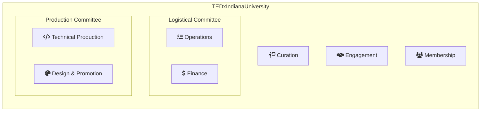

# ⁉️ About TEDx

## Org Structure

```mermaid fullWidth="true"

%%{
  init: {
    'theme': 'base',
    'themeVariables': {
      'primaryColor': '#BB2528',
      'primaryTextColor': '#fff',
      'primaryBorderColor': '#7C0000',
      'lineColor': '#F8B229',
      'secondaryColor': '#006100',
      'tertiaryColor': '#fff'

  }
}%%

graph LR
  subgraph TEDxIndianaUniversity
	  subgraph Logistical Committee
			O[fa:fa-list-check Operations]
			F[fa:fa-dollar-sign Finance]
		end
		subgraph Production Committee
			T[fa:fa-code Technical Production]
			D[fa:fa-palette Design & Promotion]
		end
		C[fa:fa-person-chalkboard Curation]
		E[fa:fa-handshake-simple Engagement]
		M[fa:fa-users Membership]
  end

```
