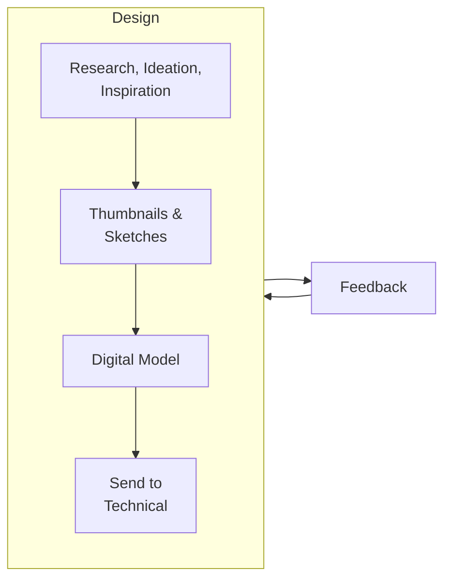

# 🤖 Digital Mockups

## Overview

```mermaid
graph LR
subgraph "Design"
A["Research, Ideation,\nInspiration"] --> B["Thumbnails &\nSketches"] --> C["Digital Model"] --> D["Send to\nTechnical"]
end
E["Feedback"] --> Design
Design --> E
```

## Thumbnails

## Software

### SketchUp Free (Free, Web-Based)



