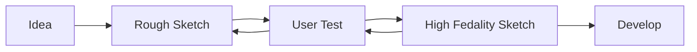

# 🔗 Web Development

## About Web Dev at TEDxIndianaUniversity

We utilise Wix Studio, which allows us to create a full stack website while still allowing updates of the site to be made by people unfamiliar with web development. It's hard to strike a balance between these two. After all, as a student organisation, it's hard to guarentee that you'll have several web developers on staff. However, if you know web development, you can achieve a level of design and implementation that frameworks and website builders can only hope to reach. Wix Studio is somewhere in the middle of these two: requiring that you think responsively while still allowing for a drag-and-drop experience for simple and complex elements alike.

## Front End

Front end work is extremely important to TEDxIndianaUniversity. For a number of years, we utilised (practically) a static website, and this worked fine, because all we required was text and images. Consistent with _Ideas Worth Spreading_, we want an inspiring experience for our users, which leads to much thought about user experience and web design. When considering front end, we oft (and should always) design utilising iterative design fundamentals. Consider the following

## Back End

That being said, it can be helpful to have some back-end functionality on our site. This is less common work, and we have to be _**very careful**_ that any back-end work that we do is transferable to the next generation of leaders. As such, it's our responsibility as student developers to consider whether our implementation would make things _easier or harder_ for future developers. Some features may make things a lot easier (e.g. the use of Wix CMS), so long as it is well documented here. As such, when you consider doing back end at TEDxIndianaUniversity, always ask yourself these questions:

1. Does this code really make anyone's lives easier?
2. Can this code survive after I've graduated?
3. Is the friction of learning/understanding how to use this code easier than doing everything manually?
4. Am I willing to document what is done, how it works, and how it is utilised?

