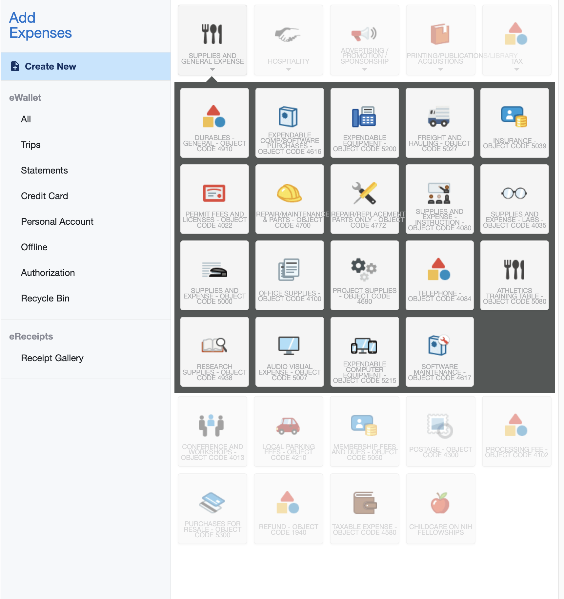

# UX Sketching

## What is UX Sketching?

Rather than wasting a lot of time coding, recoding, and then recoding a site with every design change that needs to happen, we UX sketch (User Experience Sketch) sites quickly and get ideas out on physical paper. We can easily modify our ideas when they're on a sheet of paper, which makes it perfect for the beginning phases of design. _So we keep sketching! Over and over!_ Once we're completely happy with our ideas, _**only then**_ will we start transferring them to a digital form.

<figure><figcaption>
An example of UX Sketching
</figcaption></figure>

## Steps to Sketching

* **3 Minutes:** Grab paper, pens, markers, and pencils. No computers in sight.
* **5-10 Minutes:** Answer these questions... and write them on a sheet of paper.
  * What are our users coming here for? What are _**their goals? Their needs?**_
  * What are we trying to make them do? What are _**our goals? Our needs?**_
  * What are the most important things to have on this site? (Hint: it's usually areas where the above goals aline, both our's and the user's)
* **3-5 Minutes:** Get the nerves out
  * Remember: these sketches aren't supposed to be good.&#x20;
    * Reece does not care about your sketches. They care about your ideas.
    * These sketches take a few minutes MAX. No one is creating a masterpiece in that time.
    * If you're thinking about colours and fonts, walk to the other end of the room and come back. Those thoughts aren't welcome here.
    * If you're spending time making things "look good," you aren't spending time sketching new ideas.
  * Spend a few minutes aimlessly drawing something that has no meaning
    * Start a timer for 3-5 minutes
    * Take a sheet of paper and a marker and scribble around.
    * Can you cover the paper with ink without intersecting any of the lines?
    * How many loop-de-loops can you make? Rubber ducks? Concentric smiley faces? IDK.
    * Don't think about it. Just do it.
* **8 Minutes:** Begin!
  * Glance back at your questions and answers sheets... remind yourself of the various goals and needs.
  * Start a timer for 8 minutes
  * GO! Sketch a site that solves the goals/needs. You only have a few minutes, so be sure to get all your ideas out!
  * When the timer is up, stop. No more sketching. It's okay if things are messy.
  * Repeat this 8 minute sketching process several times. Create distinct ideas each time. Try to get at least 3 distinct ideas... more if possible.
    * What happens if I prioritise one goal/need over another?&#x20;
    * What if I thought about this on mobile instead of desktop? _Vice versa_?
    * Can't get any more ideas out? Step away and come back later with a fresh perspective.

***

## Resources

### Why are we sitting here sketching? Shouldn't we be building?



### I'm not great at drawing... what are the basics I need?



