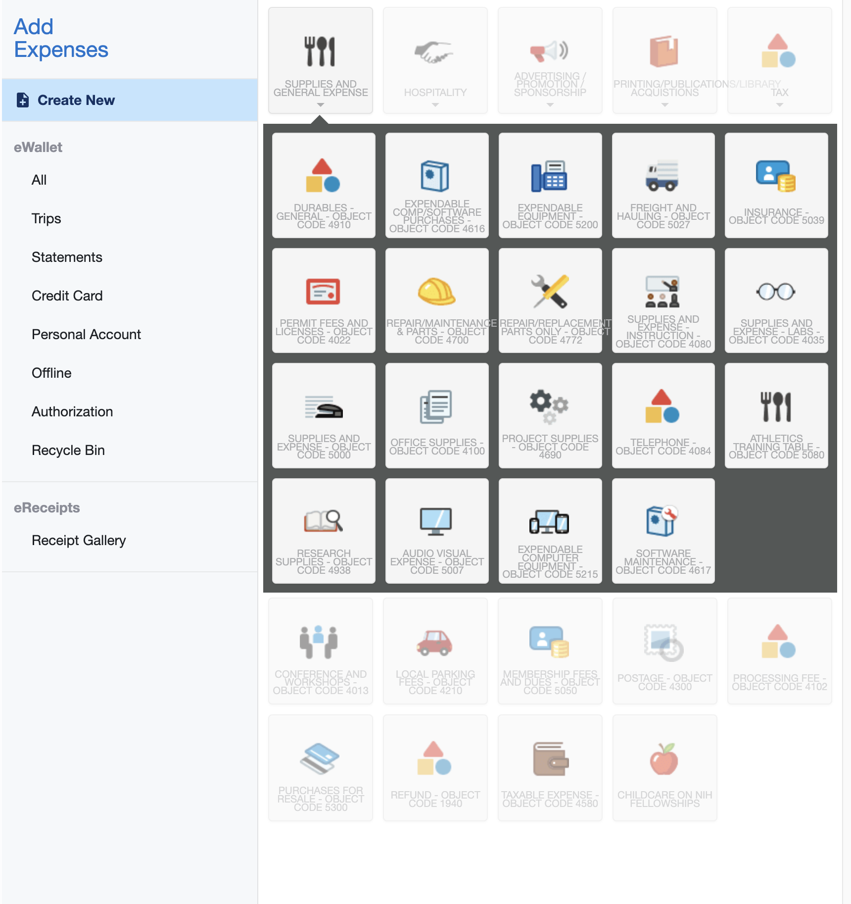

# 💸 How to Reimburse in Chrome River

## How-To

1. Visit [Chrome River (Emburse Enterprise)](https://one.iu.edu/launch-task/iu/chrome-river-travel-expense)
2. Click "Create" next to "Expenses"

<figure><figcaption></figcaption></figure>

3. Enter details; make sure "Report Type" is "Out-of-Pocket Reimbursement"&#x20;

<figure><figcaption></figcaption></figure>

4. Find the correct commodity for what you're getting reimbursed for

<figure><figcaption></figcaption></figure>

4. Fill out all the fields except for "Project Code" and "Organization Reference Id." Note the account should be `{ACCOUNT NUMBER} TEDX BL-INAD SICE SOA` and you should upload the receipt in the "Attachment" section

<figure><figcaption></figcaption></figure>

