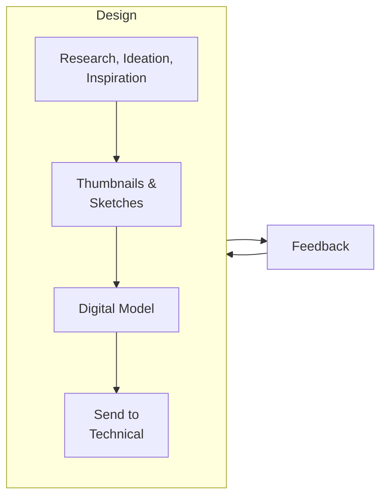

# 🤔 Ideate & Design Staging

## Overview

## Visual and Historical Research

Think about the theme or topic... What words come to mind? What visuals? What historical periods or cultural elements? What verbs or adjectives? Start in this phase of "just letting your brain steep." After you dump a bunch of words and ideas out onto a paper or whiteboard or document, begin to do some research. Research for stage design can be formal, in the case of historical events, or _very informal_, like scrolling the web for image inspiration. Collect anything that catches your eye and save it for later. (These don't have to be stage designs; for example, saving a photo of a plant or a fanart sketch is totally valid! This is about what inspires you.)

## Thumbnails

Thumbnails are quick-and-dirty sketches that help stage designers express their ideas. Using some of the [research](ideate-and-design-staging.md#visual-and-historical-research) you collected, put together 3-5 sketches of different stage designs. How can you take some of your ideas and put them on a stage? Think outside the box! Don't worry yourself with technical details.

Here's some resources to get you started:

<table data-view="cards"><thead><tr><th></th><th data-type="files"></th><th></th></tr></thead><tbody><tr><td><strong>Buskirk-Chumley Tech Specs</strong></td><td><a href="../../.gitbook/assets/Technical-Specifications.pdf">Technical-Specifications.pdf</a></td><td><em>BCT stage dimensions and more</em></td></tr><tr><td><strong>Proscenium Thumbnail Template</strong></td><td><a href="../../.gitbook/assets/PresceniumThumbnailTemplate.pdf">PresceniumThumbnailTemplate.pdf</a></td><td><em>Use this for "traditional" proscenium theatre layouts</em></td></tr><tr><td><strong>Thrust Thumbnail Template</strong></td><td><a href="../../.gitbook/assets/ThrustThumbnailTemplate.pdf">ThrustThumbnailTemplate.pdf</a></td><td><em>Use this for thrust theatre layouts</em></td></tr></tbody></table>

## Next Steps

Now that you've drawn some thumbnail sketches, collaborated with your team, and got feedback... it's time for [making-a-model.md](making-a-model.md "mention")!
